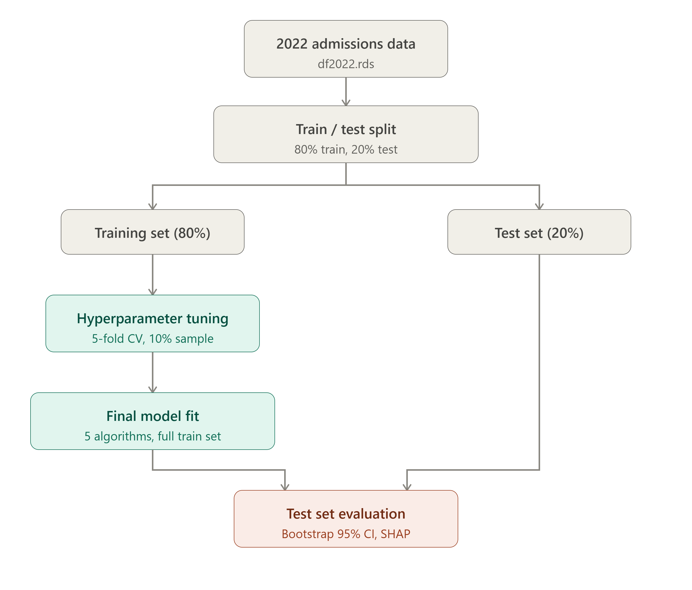
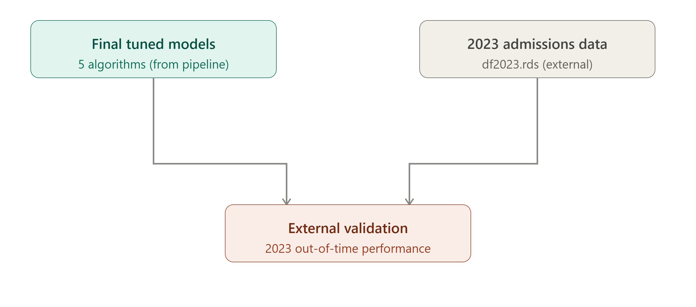

# Hospital Length of Stay Prediction

## Overview
Length of stay (LOS) is one of the key indicators used by hospitals and health system planners to assess resource utilisation, forecast bed capacity, and evaluate efficiency of inpatient care. Prolonged or unpredictable hospitalisations place substantial strain on staffing, equipment, and budgetary planning, making accurate LOS prediction a priority for evidence-based healthcare management.

The growing availability of routinely collected administrative hospital data has created new opportunities to move beyond traditional statistical approaches to LOS prediction. Machine learning (ML) methods offer a promising avenue in this context, given their capacity to model complex, non-linear relationships between patient-, admission-, and hospital-level characteristics without requiring strong a priori assumptions about functional form. As administrative datasets continue to expand in both volume and granularity, ML-based approaches are increasingly well positioned to support more accurate and scalable LOS prediction than conventional regression-based methods alone.

Despite this potential, evidence on ML-based LOS prediction remains geographically concentrated in high-income settings, with comparatively little known about model performance and predictor relevance in Central Asian health systems. Kazakhstan presents a particularly relevant and underexplored context: the country introduced its Mandatory Social Health Insurance (MSHI) scheme in recent years, fundamentally reshaping how hospital services are financed and reimbursed. This transition creates both a need and an opportunity to examine LOS patterns and their predictors under the new financing structure, using nationally representative administrative data.

This project addresses this gap by developing and comparing multiple ML approaches for LOS prediction using hospital administrative records from Kazakhstan, with the aim of informing resource planning and contributing context-specific evidence from a setting that remains underrepresented in the LOS prediction literature.


## Data

The analysis is based on anonymised inpatient administrative records from hospital admissions.

- **Time period:** 2018–2022 (with extended processing for 2023 in a supplementary pipeline)
- **Unit of analysis:** Hospital admission episode
- **Outcome variable:** Length of stay (LOS), modelled as a categorical class (5 levels; see *Outcome Variable Categorisation* below)
- **Cohort restriction:** The dataset was restricted to observations reimbursed under the Mandatory Social Health Insurance (MSHI) scheme
- **Predictor domains:**
  - Demographic characteristics
  - Clinical diagnoses
  - Admission type and outcomes
  - Socioeconomic and insurance status
  - Hospital organisational characteristics


### Outcome Variable: LOS Derivation and Categorisation
- LOS was derived automatically from routinely collected administrative data, defined as the number of days between the date of admission and the date of discharge, death, or referral.
- No missing or implausible values were identified for the outcome variable, as the hospital registry system does not permit incomplete inpatient spells at the point of registration.
- LOS was categorised into five clinically meaningful groups to account for its right-skewed distribution:

  | Class | Range (days) | Clinical interpretation |
  |---|---|---|
  | 1 | 0–4 | Short, uncomplicated acute admissions |
  | 2 | 5–9 | Subacute monitoring phase |
  | 3 | 10–19 | Medically complex cases with complications or delayed recovery |
  | 4 | 20–29 | Prolonged stays requiring high resource consumption and multidisciplinary input |
  | 5 | ≥30 | Extreme admissions involving the most clinically vulnerable patients |


### Missing Data Handling
- Missingness in predictor variables was minimal (< 0.03%) and was not systematically related to observed characteristics at either the patient or hospital level; affected observations were omitted.
- **Admission outcome imputation** followed a rule-based procedure:
  - Where the recorded treatment outcome indicated death, the admission outcome was deterministically assigned as death.
  - For remaining observations with missing admission outcomes, cases were redistributed across non-death outcome categories in proportion to their observed distribution in the complete data.


### Train/Test Split and External Validation
- The **2022 dataset** was randomly partitioned into **training (80%)** and **test (20%)** subsets, used for model development and internal evaluation, respectively.
- The independent **2023 dataset** was reserved exclusively for **external temporal validation** and was not used at any stage of model development or hyperparameter tuning, ensuring an unbiased estimate of temporal generalisability.

Due to data privacy restrictions, raw data are not publicly available. Only derived and anonymised analytical datasets are used in this repository.

## Feature Engineering
All feature engineering steps described below were implemented in R, primarily using base R and the `dplyr/tidyr` packages for data manipulation.
### 1. ICD-10 Classification
- ICD-10 diagnosis codes were truncated to the 3-character level.
- Codes were grouped into WHO ICD-10 chapters (I–XXII).
- Chapters were further aggregated into clinically meaningful disease categories (e.g., infectious diseases, circulatory system, neoplasms).
- A binary diagnosis-item matrix was constructed for modelling purposes.

### 2. Demographic Features
- Age was stratified into five clinically informed groups, reflecting the observed distribution of admitted patients and established age-related differences in hospitalisation patterns:
  - 0–4 years (newborn/infant)
  - 5–17 years (child)
  - 18–44 years (young adult)
  - 45–71 years (middle-aged adult)
  - ≥72 years (senior)
- Sex was standardised into binary categories (male/female).
- Both variables were transformed into one-hot encoded representations.

### 3. Socioeconomic Status (Employment / Insurance Type)
- Employment status was used to infer Mandatory Social Health Insurance (MSHI) contribution type (self-paid vs. MSHI-covered).
- Derived categorical indicators were encoded as binary features.

### 4. Admission Characteristics
- Admission type was classified as planned vs. emergency.
- Admission outcomes were harmonised into four categories: discharged, referred, death, and self-discharge.
- Clinical complication status was binarised (presence vs. absence of complication).

### 5. Clinical Specialty Mapping
Hospital ward profiles were mapped into broader clinical domains:
- Internal medicine
- Surgery
- Pediatrics
- Oncology / Hematology
- Neurology / Neurosurgery
- Orthopedics / Trauma
- Other specialties

This aggregation reduces dimensionality while preserving clinical interpretability.

### Hospital-Level Characteristics
Hospital administrative data were merged using facility identifiers to enrich patient-level records. Derived variables include:
- **Hospital level:** regional, city, rural, republican
- **Ownership type:** public vs. private
- **Geographical region:** North, South, East, West, Central, National status

All hospital-level variables were transformed into binary indicator matrices for modelling.

Due to data privacy restrictions, raw data are not publicly available. Only derived and anonymised analytical datasets are used in this repository. All data preparation, feature engineering, modelling, and evaluation were performed in R.

### Feature Encoding
Categorical predictors were transformed into numeric representations using two strategies, selected according to the distributional characteristics of each variable:
- **Target encoding:** categories mapped to the mean outcome value for that category, based on the training data distribution
- **One-hot encoding:** applied to remaining categorical variables

### Spatial and Geographic Features
Hospital regional identifiers were used to classify facilities into macro-geographical zones of Kazakhstan, enabling spatial analysis of service provision patterns and regional variation in hospital utilisation.

## Final Analytical Dataset

All engineered feature blocks were merged at the patient-episode level using a unique identifier. The final dataset includes:
- Diagnosis features
- Demographic variables
- Socioeconomic indicators
- Admission characteristics
- Clinical specialty indicators
- Hospital-level attributes
- Outcome variable (LOS class, 5 categories)

The resulting dataset is a high-dimensional binary feature matrix designed for statistical modelling and machine learning applications.

### Input Files
- `df2022.rds` – final feature-engineered dataset for model development (training/test split)
- `df2023.rds` – final feature-engineered dataset for external temporal validation


## Methodology
| Model | Script | Description |
|---|---|---|
| Random Forest | `02_RandomForest_tuning.R` | Bagged decision tree ensemble (`randomForest`/`ranger`); hyperparameters (mtry, ntree, node size) tuned via 5-fold CV grid search on a 10% stratified subsample, final model refit on the full training set and evaluated on the held-out test set |
| XGBoost | `03_XGBoost_tuning.R` | Gradient-boosted trees; hyperparameters (max depth, learning rate, subsample, colsample) tuned via 5-fold CV grid search on a 10% stratified subsample, final model refit on the full training set and evaluated on the held-out test set |
| LightGBM | `04_LightGBM_tuning.R` | Gradient-boosted trees with leaf-wise growth (`lightgbm`); hyperparameters (num_leaves, learning rate, feature_fraction, bagging_fraction) tuned via 5-fold CV grid search on a 10% stratified subsample, final model refit on the full training set and evaluated on the held-out test set |
| Artificial Neural Network (ANN) | `05_ANN_tuning.R` | Single-hidden-layer feedforward network (`nnet`); hyperparameters (hidden units, weight decay) tuned via 5-fold CV grid search on a 10% stratified subsample with centered/scaled inputs, final model refit on the full training set and evaluated on the held-out test set |
| Multinomial Logistic Regression | `06_MultinomialLR.R` | Baseline multinomial logit model (`nnet::multinom`), fit directly on the full training set and evaluated on the held-out test set, used for interpretable benchmarking |

All models were implemented in R: Random Forest (`randomForest/ranger`), XGBoost (`xgboost`), LightGBM (`lightgbm`), ANN (`nnet`), and Multinomial Logistic Regression (`nnet::multinom`).

## Evaluation Metrics

For each model and each LOS class, the following one-vs-rest metrics were computed on the held-out test set:

- Precision (Positive Predictive Value)
- Recall (Sensitivity)
- F1 score
- AUC (ROC)

**Uncertainty quantification:** 95% confidence intervals for all metrics were estimated via non-parametric bootstrap resampling (B = 1,000 resamples) of the test set.

## Feature Importance

- Top predictive features were identified using XGBoost gain-based importance scores.
- For the multinomial logistic regression model, variable importance was approximated as the mean absolute coefficient across outcome classes.

<p align="center">
  
</p>


<p align="center">
  
</p>

## Requirements

This project is implemented entirely in **R** (version ≥ 4.2 recommended), using the following core packages:

```r
install.packages(c(
  "caret", "xgboost", "lightgbm", "randomForest", "ranger",
  "nnet", "pROC", "SHAPforxgboost", "shapviz", "dplyr", "tidyr"
))
```

## Repository Structure
project/
├── mapping.R                       # Data cleaning and feature engineering

├── 01_data_preparation.R           # Train/test split and preprocessing
├── 02_RandomForest_tuning.R        # Random Forest hyperparameter tuning and final model
├── 03_XGBoost_tuning.R             # XGBoost hyperparameter tuning and final model
├── 04_LightGBM_tuning.R            # LightGBM hyperparameter tuning and final model
├── 05_ANN_tuning.R                 # ANN hyperparameter tuning and final model
├── 06_MultinomialLR.R              # Multinomial logistic regression model
├── evaluation_bootstrap_CI.R       # Class-specific metrics with 95% bootstrap CIs
├── README.md                       # Project documentation
├── data/                           # Example or processed datasets (if shareable)
└── figures/                        # Output plots and visualisations
