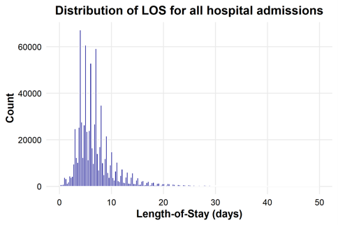
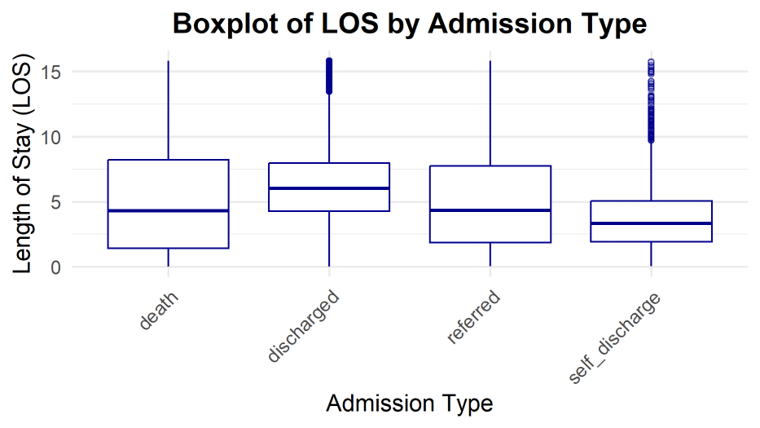
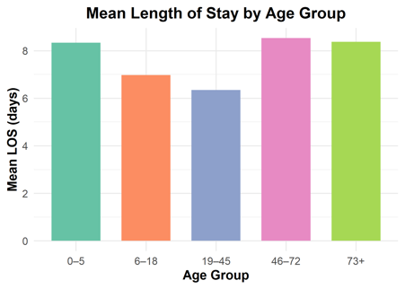

# Hospital Length of Stay Prediction

> **Data Notice:** This repository contains R scripts and code only. Any example or `data/` files included here are *synthetic placeholder data* provided solely to illustrate the expected structure and format for the pipeline to run; they do **not** represent real patient data and must not be used for any clinical, epidemiological, or research inference. The real administrative dataset used in this study is not publicly available and must be officially requested from the data holder.

## Overview

Length of stay (LOS) is one of the key indicators used by hospitals and health system planners to assess resource utilisation, forecast bed capacity, and evaluate the efficiency of inpatient care. Prolonged or unpredictable hospitalisations place substantial strain on staffing, equipment, and budgetary planning, making accurate LOS prediction a priority for evidence-based healthcare management.

The growing availability of routinely collected administrative hospital data has created new opportunities to move beyond traditional statistical approaches to LOS prediction. Machine learning (ML) methods offer a promising avenue in this context, given their capacity to model complex, non-linear relationships between patient-, admission-, and hospital-level characteristics without requiring strong a priori assumptions about functional form. As administrative datasets continue to expand in both volume and granularity, ML-based approaches are increasingly well positioned to support more accurate and scalable LOS prediction than conventional regression-based methods alone.

Despite this potential, evidence on ML-based LOS prediction remains geographically concentrated in high-income settings, with comparatively little known about model performance and predictor relevance in Central Asian health systems. Kazakhstan presents a particularly relevant and underexplored context, as the country introduced its Mandatory Social Health Insurance (MSHI) scheme in recent years, fundamentally reshaping how hospital services are financed and reimbursed. This transition creates both a need and an opportunity to examine LOS patterns and their predictors under the new financing structure, using nationally representative administrative data.

This project addresses this gap by developing and comparing multiple ML approaches for LOS prediction using hospital administrative records from Kazakhstan, with the aim of informing resource planning and contributing context-specific evidence from a setting that remains underrepresented in the LOS prediction literature.

## Data

The analysis draws on hospital administrative records covering the period 2022–2023, with the hospital admission episode defined as the unit of analysis. The outcome variable, length of stay, was modelled as a categorical variable comprising five clinically defined levels (see *Outcome Variable Derivation and Categorisation* below). The analytic cohort was restricted to observations reimbursed under the Mandatory Social Health Insurance (MSHI) scheme. Predictor variables span five domains: demographic characteristics, clinical diagnoses, admission type and outcomes, socioeconomic and insurance status, and hospital organisational characteristics.

### Data Availability

Access to the real data is restricted due to data privacy and governance requirements, and must be formally requested from the Ministry of Health, subject to their data-sharing policies and any required institutional or ethical approvals. Researchers interested in accessing the underlying data should contact the data holder or the corresponding author for guidance on the request procedure.

### Outcome Variable: Derivation and Categorisation

Length of stay was derived automatically from routinely collected administrative data and defined as the number of days between the date of admission and the date of discharge, death, or referral. No missing or implausible values were identified for the outcome variable, as the hospital registry system does not permit incomplete inpatient spells at the point of registration. To account for its right-skewed distribution, LOS was categorised into five clinically meaningful groups.


| Class | Range (days) | Clinical interpretation |
|---|---|---|
| 1 | 0–4 | Short, uncomplicated acute admissions |
| 2 | 5–9 | Subacute monitoring phase |
| 3 | 10–19 | Medically complex cases with complications or delayed recovery |
| 4 | 20–29 | Prolonged stays requiring high resource consumption and multidisciplinary input |
| 5 | ≥30 | Extreme admissions involving the most clinically vulnerable patients |

### Missing Data Handling

Missingness in predictor variables was minimal (< 0.03%) and was not systematically related to observed characteristics at either the patient or hospital level; affected observations were omitted from the analysis. Admission outcome was handled through a rule-based imputation procedure: where the recorded treatment outcome indicated death, the admission outcome was deterministically assigned as death, whereas for the remaining observations with missing admission outcomes, cases were redistributed across non-death outcome categories in proportion to their observed distribution in the complete data.

### Train/Test Split and External Validation

The 2022 dataset was randomly partitioned into training (80%) and test (20%) subsets, used respectively for model development and internal evaluation. The independent 2023 dataset was reserved exclusively for external temporal validation and was not used at any stage of model development or hyperparameter tuning, thereby ensuring an unbiased estimate of temporal generalisability.

## Descriptive Statistics

### Distribution of Length of Stay

<p align="center">
  
</p>


<p align="center">
  
</p>


<p align="center">
  
</p>

## Feature Engineering

All feature engineering steps described below were implemented in R, primarily using base R and the `dplyr`/`tidyr` packages for data manipulation.

### 1. ICD-10 Classification

ICD-10 diagnosis codes were truncated to the 3-character level and grouped into WHO ICD-10 chapters (I–XXII), which were further aggregated into clinically meaningful disease categories (e.g., infectious diseases, circulatory system, neoplasms). A binary diagnosis-item matrix was subsequently constructed for modelling purposes.

### 2. Demographic Features

Age was stratified into five clinically informed groups, reflecting the observed distribution of admitted patients and established age-related differences in hospitalisation patterns: 0–4 years (newborn/infant), 5–17 years (child), 18–44 years (young adult), 45–71 years (middle-aged adult), and ≥72 years (senior). Sex was standardised into binary categories (male/female), and both variables were transformed into one-hot encoded representations.

### 3. Socioeconomic Status (Employment / Insurance Type)

Employment status was used to infer Mandatory Social Health Insurance (MSHI) contribution type (self-paid versus MSHI-covered), and the resulting categorical indicators were encoded as binary features.

### 4. Admission Characteristics

Admission type was classified as planned versus emergency, and admission outcomes were harmonised into four categories: discharged, referred, death, and self-discharge. Clinical complication status was binarised to reflect the presence or absence of a complication.

### 5. Clinical Specialty Mapping

Hospital ward profiles were mapped into seven broader clinical domains: internal medicine, surgery, paediatrics, oncology/haematology, neurology/neurosurgery, orthopaedics/trauma, and other specialties. This aggregation reduces dimensionality while preserving clinical interpretability.

### Hospital-Level Characteristics

Hospital administrative data were merged using facility identifiers to enrich patient-level records. Derived variables include hospital level (regional, city, rural, republican), ownership type (public versus private), and geographical region (North, South, East, West, Central, and National status). All hospital-level variables were transformed into binary indicator matrices for modelling.

All data preparation, feature engineering, modelling, and evaluation were performed in R.

### Feature Encoding

Categorical predictors were transformed into numeric representations using two strategies, selected according to the distributional characteristics of each variable: target encoding, whereby categories were mapped to the mean outcome value for that category based on the training data distribution, and one-hot encoding, applied to the remaining categorical variables.

### Spatial and Geographic Features

Hospital regional identifiers were used to classify facilities into macro-geographical zones of Kazakhstan, enabling spatial analysis of service provision patterns and regional variation in hospital utilisation.

## Final Analytical Dataset

All engineered feature blocks were merged at the patient-episode level using a unique identifier, yielding a final dataset comprising diagnosis features, demographic variables, socioeconomic indicators, admission characteristics, clinical specialty indicators, hospital-level attributes, and the outcome variable (LOS class, five categories). The resulting dataset is a high-dimensional binary feature matrix designed for statistical modelling and machine learning applications.

### Input Files

The final feature-engineered dataset used for model development, comprising the training and test split, is stored as `synthetic_train.rds` and `synthetic_test.rds`, while the corresponding dataset reserved for external temporal validation is stored as `synthetic_external2023.rds`.

## Methodology

| Model | Script | Description |
|---|---|---|
| Random Forest | `02_RandomForest_tuning.R` | Bagged decision tree ensemble (`randomForest`/`ranger`); hyperparameters (mtry, ntree, node size) tuned via 5-fold CV grid search on a 10% stratified subsample, final model refit on the full training set and evaluated on the held-out test set |
| XGBoost | `03_XGBoost_tuning.R` | Gradient-boosted trees; hyperparameters (max depth, learning rate, subsample, colsample) tuned via 5-fold CV grid search on a 10% stratified subsample, final model refit on the full training set and evaluated on the held-out test set |
| LightGBM | `04_LightGBM_tuning.R` | Gradient-boosted trees with leaf-wise growth (`lightgbm`); hyperparameters (num_leaves, learning rate, feature_fraction, bagging_fraction) tuned via 5-fold CV grid search on a 10% stratified subsample, final model refit on the full training set and evaluated on the held-out test set |
| Artificial Neural Network (ANN) | `05_ANN_tuning.R` | Single-hidden-layer feedforward network (`nnet`); hyperparameters (hidden units, weight decay) tuned via 5-fold CV grid search on a 10% stratified subsample with centred/scaled inputs, final model refit on the full training set and evaluated on the held-out test set |
| Multinomial Logistic Regression | `06_MultinomialLR.R` | Baseline multinomial logit model (`nnet::multinom`), fit directly on the full training set and evaluated on the held-out test set, used for interpretable benchmarking |

All models were implemented in R: Random Forest (`randomForest`/`ranger`), XGBoost (`xgboost`), LightGBM (`lightgbm`), ANN (`nnet`), and Multinomial Logistic Regression (`nnet::multinom`).

## Evaluation Metrics

For each model and each LOS class, four one-vs-rest metrics were computed on the held-out test set: precision (positive predictive value), recall (sensitivity), F1 score, and area under the ROC curve (AUC). Ninety-five percent confidence intervals for all metrics were estimated via non-parametric bootstrap resampling (B = 1,000 resamples) of the test set.

## Feature Importance

Top predictive features were identified using XGBoost gain-based importance scores, while for the multinomial logistic regression model, variable importance was approximated as the mean absolute coefficient across outcome classes.

## Modelling Pipeline

### Core Pipeline: Tuning, Training, and Test Evaluation

<p align="center">
  
</p>

The 2022 dataset was randomly partitioned into training (80%) and test (20%) subsets. Hyperparameters for each model were tuned using 5-fold cross-validation on a 10% stratified subsample of the training set, selected via macro-averaged F1 score to account for class imbalance across LOS categories. Once tuned, each model was refit on the full training set, then evaluated on the held-out test set using class-specific precision, recall, F1, and AUC, each accompanied by 95% bootstrap confidence intervals (B = 1,000 resamples).

### External Temporal Validation

<p align="center">
  
</p>

To assess temporal generalisability, the final tuned models were additionally evaluated on an independent 2023 dataset, held out entirely from model development and hyperparameter tuning. This provides an unbiased estimate of how well each model's predictive performance holds up when applied to a different time period than the one on which it was trained.

## Requirements

This project is implemented entirely in **R** (version ≥ 4.2 recommended), using the following core packages:

```r
install.packages(c(
  "caret", "xgboost", "lightgbm", "randomForest", "ranger",
  "nnet", "pROC", "SHAPforxgboost", "shapviz", "dplyr", "tidyr"
))
```

## Repository Structure

```
project/
├── README.md                         # Project documentation
├── Data/                             # Synthetic placeholder data only (see Data/README.md)
│   ├── README.md                     # Data notice
│   ├── synthetic_external2023.rds    # Synthetic dataset (2023)
│   ├── synthetic_test.rds            # Synthetic dataset (2022)
│   └── synthetic_train.rds           # Synthetic dataset (2022)
├── Model/                            # All analysis and modelling scripts
│   ├── 01_data_preparation.R         # Train/test split and preprocessing
│   ├── 02_RF_tuning.R                # Random Forest hyperparameter tuning and final model
│   ├── 03_XGBoost_tuning.R           # XGBoost hyperparameter tuning and final model
│   ├── 04_LightGBM_tuning.R          # LightGBM hyperparameter tuning and final model
│   ├── 05_ANN.R                      # ANN hyperparameter tuning and final model
│   ├── 06_MultinomialLR.R            # Multinomial logistic regression model
│   ├── 07_CatBoost.R                 # CatBoost
│   ├── 08_External_Validation_2023.R # External validation on 2023 data
│   └── evaluation_bootstrap_CI.R     # Class-specific metrics with 95% bootstrap CIs
└── Figures/                          # Output plots and visualisations
```
